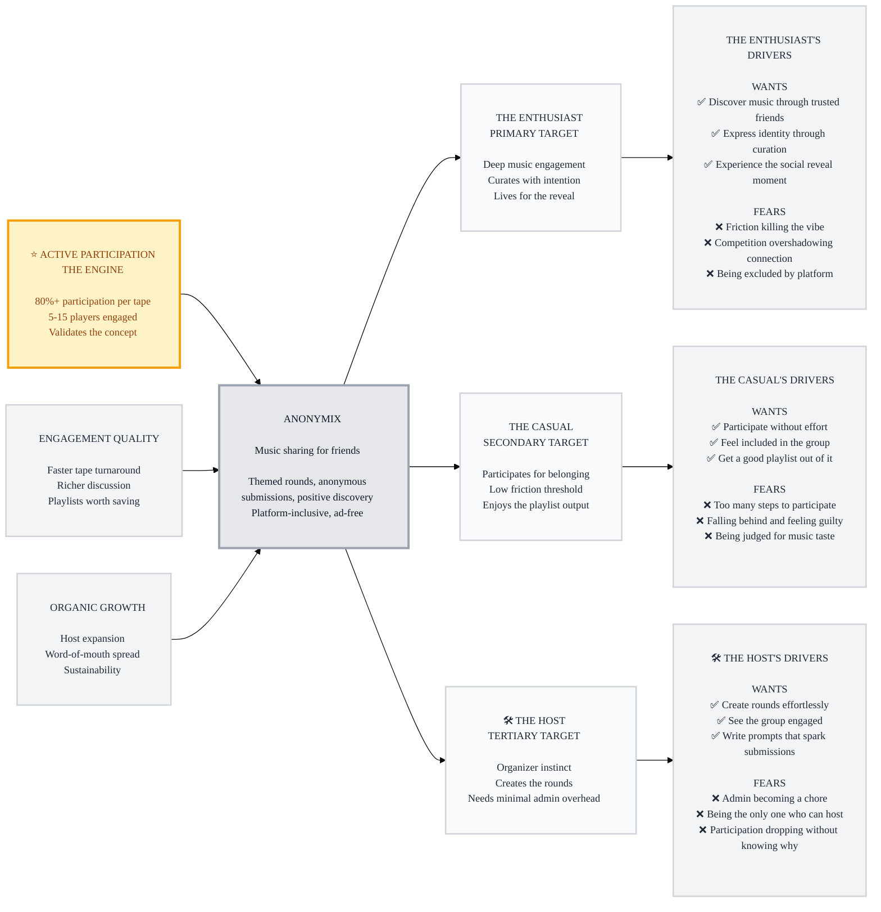

# Trigger Map: Anonymix

> Connecting business goals to user psychology — the strategic foundation for all design decisions

**Document:** Trigger Map - Hub & Visual Overview
**Created:** 2026-03-24
**Status:** COMPLETE

---

## How to Read This Map

The Trigger Map flows **left to right**: Business Goals define what success looks like → Anonymix is the product that achieves them → Target Groups are the people who use it → Driving Forces reveal why they act (and what stops them).

**Design against the driving forces, not against features.** Solutions come later.

---

## The Transformation

**From:** Friends scattered across platforms, dealing with ads and friction, competing instead of connecting, losing momentum on music sharing

**To:** A frictionless, platform-inclusive ritual where friends discover music through each other, every round ends in a shared playlist, and the experience is about resonance — not ranking

---

## Visual Trigger Map

---

## The Flywheel

**⭐ THE ENGINE (Priority #1): Active Participation**
- 80%+ participation per tape across 5-15 players
- Timeline: First 2-3 sessions
- Engaged players validate the concept and generate the social energy that makes rounds worthwhile
- This drives ALL other objectives

**🚀 ENGAGEMENT QUALITY (Priority #2):**
- Driven BY active participation — can't have great discussions without people showing up
- Faster turnaround, richer comments, playlists worth saving
- Timeline: Ongoing from session 1

**🌟 ORGANIC GROWTH (Priority #3):**
- Natural outcome of a genuinely good experience
- Others host sessions, players invite friends
- Timeline: 2+ months, no pressure

---

## Business Strategy

**Core insight:** Anonymix wins on two fronts — **friction elimination** and **social discovery**. The highest-priority driving forces across all personas cluster around these themes.

**Friction elimination** (scores 14-15 across all personas):
- No ads, no auth loops, no platform lock-in
- Submit = search + tap. Comment = listen + share what resonated.
- Host creates tape in one screen.

**Social discovery** (scores 14-15 for primary persona):
- Anonymous curation removes social bias
- The reveal is a designed social moment
- The playlist is lasting value, not just a game result

---

## Persona Summaries

### 🎯 The Enthusiast (PRIMARY)
The heartbeat of any session. Sees each prompt as a creative opportunity. Agonizes over their pick, listens to everything, writes real comments, saves the playlist. Motivated by discovery and connection. Frustrated by friction and competition focus.

**Top drivers:** Discover through friends (15), No friction (15), The reveal (14)

→ [Full persona](personas/01-the-enthusiast.md)

### 👥 The Casual (SECONDARY)
Makes up the majority of any group. Enjoys the game but won't fight through obstacles. Submits most rounds, comments briefly, reads others' comments. Motivated by belonging and ease. Drifts away when participation costs exceed reward.

**Top drivers:** Effortless participation (14), Minimal steps (14), Group inclusion (13)

→ [Full persona](personas/02-the-casual.md)

### 🛠️ The Host (TERTIARY)
The organizer who keeps the game running. Creates sessions, writes prompts, manages timing. Needs admin to be minimal or they'll burn out. Usually an Enthusiast with an organizer instinct.

**Top drivers:** Admin not a chore (14), Effortless creation (13), Engagement visibility (13)

→ [Full persona](personas/03-the-host.md)

---

## Strategic Implications

### Design Focus Statement

**Anonymix transforms music sharing from a friction-heavy, platform-locked competition into a frictionless, inclusive ritual of discovery — where the playlist is the artifact, the reveal is the moment, and resonance replaces ranking.**

**Primary Design Target:** The Enthusiast

**Must Address (Core Product):**
1. Friction → Zero ads, clean auth, fast PWA
2. Platform exclusion → Spotify + YouTube Music as equals
3. Competition framing → Resonance language, no aggregate leaderboard
4. Effortless participation → Minimal steps for submit and comment
5. Admin fatigue → One-screen tape creation, smart defaults

**Should Address (Enhancement):**
1. Casual inclusion → Notifications, deadline reminders, welcoming onboarding
2. Taste judgment → Anonymous submissions protect everyone
3. Playlist value → Auto-generated on user's platform
4. Host visibility → Glanceable submission/comment status
5. Identity expression → Custom prompts, one-song curation format

### Emotional Transformation Goals

- "I actually look forward to the new prompt dropping"
- "I discovered an amazing song I never would have found on my own"
- "I love that moment when you find out who picked what"
- "This is the easiest way to share music with my friends"
- "I don't feel pressure to be a 'music person' — I just pick what I like"

---

## Related Documents

| Document | Purpose |
|----------|---------|
| [01-Business-Goals.md](01-Business-Goals.md) | Vision, objectives, flywheel, metrics |
| [personas/01-the-enthusiast.md](personas/01-the-enthusiast.md) | Primary persona — deep profile + drivers |
| [personas/02-the-casual.md](personas/02-the-casual.md) | Secondary persona — deep profile + drivers |
| [personas/03-the-host.md](personas/03-the-host.md) | Tertiary persona — deep profile + drivers |
| [feature-impact-analysis.md](feature-impact-analysis.md) | Prioritized driving forces with scoring |

---

_Trigger Map complete. Design against these forces — not against features._
